# SAP Commerce VS-Tools

**Developer tools for SAP Commerce in Visual Studio Code** – run FlexibleSearch, SQL, Groovy and ImpEx against your hAC,
get real language support for ImpEx, FlexibleSearch and the commerce XML files, navigate your type system, draw diagrams,
build and run the platform, and give your AI assistant read-only knowledge of your project.

[](https://github.com/Dyxa85/sap-commerce-vs-tools/actions/workflows/ci.yml)
[](LICENSE)

> **Unofficial project.** Not affiliated with, endorsed by, or sponsored by SAP SE or any other company.
> "SAP" and "SAP Commerce" are trademarks of SAP SE and are used here only to describe compatibility.

**Target platform:** SAP Commerce `2211-jdk21` · **VS Code:** 1.101 or newer · **Status:** first release candidate (0.1.0)

## Get it running in two minutes

1. Download `sap-commerce-vs-tools-<version>.vsix` from the [latest release](https://github.com/Dyxa85/sap-commerce-vs-tools/releases/latest).
2. In VS Code: **Extensions** view → `⋯` menu → **Install from VSIX…** and pick the file.
3. Open the folder that contains your `hybris` directory, then run **SAP Commerce: Add Connection…** from the Command Palette.

Step by step: installing, connecting, first steps, all settings, building from source, and troubleshooting:
**[docs/howto-enable-in-vscode.md](docs/howto-enable-in-vscode.md)** ([Deutsch](docs/howto-enable-in-vscode.de.md)).

## What you get

### Work with your instance (hAC)

- **FlexibleSearch and SQL** from the editor (`Cmd/Ctrl+Enter`), results in a sortable, filterable table with CSV/JSON export; `?parameters` are asked for.
- **Groovy** scripts run in rollback mode by default; commit needs an explicit confirmation.
- **ImpEx** validate and import; failed imports show the unresolved lines with the reason.
- **PK analyzer**, **log-level changes**, query/script **history**.
- **Several connections** (Local, Dev, Stage …) with a status bar switcher; mark production-like systems as _protected_.

### Understand your code

- **ImpEx and FlexibleSearch editors** whose diagnostics mirror what the importer and the hAC really do (measured on a real instance, see [docs/impex-behaviour.md](docs/impex-behaviour.md)): unknown types and attributes with suggestions, macros, missing unique columns, `--` comments and trailing `;` that break the hAC, completion, hover, formatter, quick fixes.
- **Project knowledge** from your `items.xml`, `beans.xml`, Spring and business process files: go to definition across extensions and into Java sources, completion for types, attributes, enum values and bean ids, override and alias awareness.
- **Commerce Project view** in the Explorer: extensions in load order with their real folder structure (sources, resources, build files – like in an IDE), a commerce overview (type system, beans, Spring, processes, dependencies and dependents); problems in `localextensions.xml`.
- **Type and bean preview** and **Go to Type, Attribute or Enum Value…**

### See it

Diagrams are drawn by the extension itself (pan, zoom, click a node to open its definition). The images below are generated
from the synthetic fixture project of this repository.





### Build, run, debug

- **Ant** targets as commands and as tasks (`build`, `clean`, `unittests`, …) with a problem matcher for `javac` errors.
- **Start / stop the server**, also in debug mode, and **attach the Java debugger** to the port configured in your platform.
- **Configure Java** writes the settings for the Red Hat Java extension from the extensions your platform really loads.

### AI tools (MCP)

A bundled [MCP](https://modelcontextprotocol.io) server lets Copilot's agent mode and other MCP clients ask for types,
attributes, beans and extension dependencies of your project. Optional read-only queries against an instance are **off by
default**, need a user-level setting and a confirmation on every start. See [docs/mcp.md](docs/mcp.md).

## Honest limits

What is verified and what is not is listed per feature in **[docs/parity.md](docs/parity.md)**. In short:

- **Not implemented:** ACL and Polyglot Query editors (no public specification), debugger value renderers for model classes (VS Code has no API for it).
- **Not yet verified:** the Java setup against a running Red Hat Java language server, the MCP server from Copilot's agent mode, a real `ant build` from the task, Windows and Linux (developed and tested on macOS; CI covers all three).
- **Planned:** CCv2, Solr console, Cockpit NG – see [ROADMAP.md](ROADMAP.md).

## Security and privacy

- Passwords live in VS Code's secret storage, bound to URL **and** user name; never in settings, logs or command lines.
- TLS verification is on by default; `http://` to a remote host asks for confirmation before the password is sent.
- Writes (commit mode, import, log levels) ask first; protected connections always ask.
- Connections from workspace settings are ignored in untrusted workspaces; build and server commands need a trusted workspace.
- Webviews use a strict Content-Security-Policy and escape all data. **No telemetry.**

The full review is in [docs/security-review.md](docs/security-review.md); report problems privately via
[GitHub security advisories](https://github.com/Dyxa85/sap-commerce-vs-tools/security/advisories/new).

## Clean-room implementation

This project re-implements _behaviour_, not code. It is built from public documentation, SAP's official docs, files of a
locally installed platform, behaviour observed on a real instance, and original tests. It contains no code, grammars, texts
or icons from other IDE plugins. Details: [docs/provenance.md](docs/provenance.md) and [CONTRIBUTING.md](CONTRIBUTING.md).

## Repository layout

| Path                         | Purpose                                                                                |
| ---------------------------- | -------------------------------------------------------------------------------------- |
| `packages/extension`         | The VS Code extension (commands, tasks, views, webviews)                               |
| `packages/core`              | UI-free library: hAC client, languages, platform/type/bean/Spring models, graph layout |
| `packages/language-server`   | Language server (ImpEx, FlexibleSearch, items/beans/Spring/process XML)                |
| `packages/mcp-server`        | MCP server for AI tools                                                                |
| `packages/test-fixtures`     | Synthetic mini-platform used by tests                                                  |
| `tools/mock-hac`             | Deterministic mock of the hAC for tests and demos                                      |
| `tools/dev`, `tools/release` | Demo page generators, release helpers                                                  |
| `docs/`                      | Architecture, behaviour notes, security review, ADRs, retrospectives                   |

## Development

Requires Node.js ≥ 20 and pnpm.

```bash
pnpm install
pnpm format:check && pnpm lint && pnpm typecheck && pnpm test && pnpm build
pnpm --filter sap-commerce-vs-tools run test:host    # tests inside a real VS Code
pnpm mock-hac                                        # mock hAC on http://127.0.0.1:9003/hac
```

Architecture: [docs/architecture.md](docs/architecture.md) · Releasing: [docs/release.md](docs/release.md) ·
Contributing: [CONTRIBUTING.md](CONTRIBUTING.md)

## License

[Apache License 2.0](LICENSE). Third-party notices are shipped inside the extension package.
