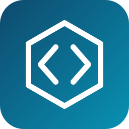
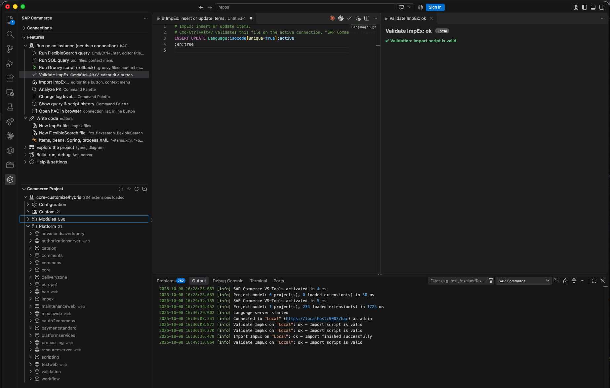

<p align="center">
  
</p>

<h1 align="center">SAP Commerce VS-Tools</h1>

<p align="center">
  <strong>Developer tools for SAP Commerce in Visual Studio Code</strong><br>
  Run FlexibleSearch, SQL, Groovy and ImpEx · write ImpEx with real type knowledge · explore types and diagrams ·
  build and run the platform · give your AI assistant project knowledge
</p>

<p align="center">
  <a href="https://github.com/Dyxa85/sap-commerce-vs-tools/releases/latest"></a>
  <a href="https://github.com/Dyxa85/sap-commerce-vs-tools/actions/workflows/ci.yml"></a>
  <a href="LICENSE"></a>
  
  
</p>

<p align="center">
  <a href="#install">Install</a> ·
  <a href="#highlights">Highlights</a> ·
  <a href="docs/features.md">Feature guide</a> ·
  <a href="docs/howto-enable-in-vscode.md">HowTo</a> ·
  <a href="#honest-limits">Limits</a> ·
  <a href="ROADMAP.md">Roadmap</a> ·
  <a href="docs/features.de.md">Deutsch</a>
</p>

<p align="center">
  
  <br>
  <sub>The <b>SAP Commerce</b> side bar (<i>Features</i> and <i>Commerce Project</i>), an ImpEx file validated on a running instance,
  and the log of what the extension did.</sub>
</p>

> **Unofficial project.** Not affiliated with, endorsed by, or sponsored by SAP SE or any other company.
> "SAP" and "SAP Commerce" are trademarks of SAP SE and are used here only to describe compatibility.

## Install

1. Download `sap-commerce-vs-tools-<version>.vsix` from the [latest release](https://github.com/Dyxa85/sap-commerce-vs-tools/releases/latest).
2. In VS Code: **Extensions** view → `⋯` → **Install from VSIX…** and pick the file.
3. Open the folder with your `hybris` directory (or your CCv2 repository) and click the **SAP Commerce** icon in the activity bar.

That is all you need to **read, write and explore** a project. To **run** queries, scripts and imports on an instance, add a
connection: side bar → **Connections** → **+**. A guided tour starts from _Welcome → Walkthroughs_.
More detail, building from source and troubleshooting: **[HowTo](docs/howto-enable-in-vscode.md)** ·
[Deutsch](docs/howto-enable-in-vscode.de.md).

## Highlights

<table>
  <tr>
    <td width="33%" valign="top">
      <h3>⚡ Run on your instance</h3>
      FlexibleSearch and SQL as a sortable table, Groovy with rollback, ImpEx validate and import, PK analyzer, log levels.
      Several connections, protected environments, one settings page.
    </td>
    <td width="33%" valign="top">
      <h3>✍️ Write with knowledge</h3>
      ImpEx and FlexibleSearch editors whose diagnostics follow what the importer and the hAC really do. Completion for
      types, attributes and enum values; formatter; quick fixes.
    </td>
    <td width="33%" valign="top">
      <h3>🧭 Navigate the project</h3>
      Go to any type, attribute, bean or Spring bean, across extensions and into Java sources.
      <code>items</code>, <code>beans</code>, Spring and process XML are fully supported.
    </td>
  </tr>
  <tr>
    <td valign="top">
      <h3>🗂️ See your structure</h3>
      <b>Commerce Project</b>: every extension with its real folders and files. <b>CCv2</b>: your repository and an outline of
      <code>manifest.json</code>.
    </td>
    <td valign="top">
      <h3>🕸️ Draw diagrams</h3>
      Type inheritance, extension dependencies and business processes as diagrams you can pan and zoom;
      click a node to open it.
    </td>
    <td valign="top">
      <h3>🏗️ Build, run, debug</h3>
      Ant targets as tasks with compiler errors in Problems, start and stop the server, attach the debugger, set up Java for
      the Red Hat extension.
    </td>
  </tr>
  <tr>
    <td colspan="3" valign="top">
      <h3>🤖 AI tools (MCP)</h3>
      A bundled <a href="https://modelcontextprotocol.io">MCP</a> server gives Copilot's agent mode read-only knowledge of
      your project: extensions, dependencies, types, attributes, beans. Read-only queries against an instance are optional,
      off by default and confirmed on every start. <a href="docs/mcp.md">Details</a>
    </td>
  </tr>
</table>

Every feature, **where to find it** and **what it needs** is listed in the **[feature guide](docs/features.md)** –
and inside VS Code in the **Features** view of the side bar.

## Diagrams

Generated by the extension's own layout and renderer from the synthetic fixture project of this repository.

<table>
  <tr>
    <td width="33%" align="center" valign="top"></td>
    <td width="33%" align="center" valign="top"></td>
    <td width="33%" align="center" valign="top"></td>
  </tr>
  <tr>
    <td align="center"><sub>Type diagram</sub></td>
    <td align="center"><sub>Extension dependencies</sub></td>
    <td align="center"><sub>Business process</sub></td>
  </tr>
</table>

## Do I need a connection to the hAC?

The **hAC** (hybris Administration Console, usually `https://localhost:9002/hac`) is the web console of a **running**
instance. A _connection_ is its address plus a user name; the password stays in VS Code's secret storage.

|                    | Works **with** a connection                                  | Works **without** one                                                                   |
| ------------------ | ------------------------------------------------------------ | --------------------------------------------------------------------------------------- |
| Run on an instance | FlexibleSearch, SQL, Groovy, ImpEx validate/import, PK, logs | –                                                                                       |
| Your files         | –                                                            | Editors, type search, diagrams, project and CCv2 views, build, server, AI project tools |

## Honest limits

What is verified and what is not is listed per feature in **[docs/parity.md](docs/parity.md)**.

- **Not implemented:** ACL and Polyglot Query editors (no public specification), debugger value renderers (VS Code has no API).
  Planned: CCv2 Cloud Portal (builds, deployments), Solr console, Cockpit NG – see the [roadmap](ROADMAP.md).
- **Not yet verified:** the Java setup against a running Red Hat Java language server, the MCP server from Copilot's agent
  mode, a real `ant build` started from the task.
- Developed and tested on **macOS**; CI runs unit tests and tests inside VS Code on Ubuntu, macOS and Windows.

## Security and privacy

- Passwords live in VS Code's secret storage, bound to URL **and** user name; never in settings, logs or command lines.
- TLS verification is on by default; `http://` to a remote host asks for confirmation before the password is sent.
- Writes (commit mode, import, log levels) ask first; protected connections always ask.
- Connections from workspace settings are ignored in untrusted workspaces; build and server commands need a trusted workspace.
- Webviews use a strict Content-Security-Policy and escape all data. **No telemetry.**

Full review: [docs/security-review.md](docs/security-review.md). Report problems privately via
[GitHub security advisories](https://github.com/Dyxa85/sap-commerce-vs-tools/security/advisories/new).

## Clean-room implementation

This project re-implements _behaviour_, not code. It is built from public documentation, SAP's official docs, files of a
locally installed platform, behaviour observed on a real instance, and original tests. It contains no code, grammars,
texts or icons from other IDE plugins. Details: [docs/provenance.md](docs/provenance.md) and [CONTRIBUTING.md](CONTRIBUTING.md).

## For contributors

<details>
<summary><b>Repository layout</b></summary>

| Path                         | Purpose                                                                                |
| ---------------------------- | -------------------------------------------------------------------------------------- |
| `packages/extension`         | The VS Code extension (commands, tasks, views, webviews)                               |
| `packages/core`              | UI-free library: hAC client, languages, platform/type/bean/Spring models, graph layout |
| `packages/language-server`   | Language server (ImpEx, FlexibleSearch, items/beans/Spring/process XML)                |
| `packages/mcp-server`        | MCP server for AI tools                                                                |
| `packages/test-fixtures`     | Synthetic mini-platform used by tests                                                  |
| `tools/mock-hac`             | Deterministic mock of the hAC for tests and demos                                      |
| `tools/dev`, `tools/release` | Demo page generators, release helpers                                                  |
| `docs/`                      | Architecture, behaviour notes, security review, ADRs, retrospectives                   |

Architecture: [docs/architecture.md](docs/architecture.md)

</details>

<details>
<summary><b>Build, test, release</b></summary>

Requires Node.js ≥ 20 and pnpm.

```bash
pnpm install
pnpm format:check && pnpm lint && pnpm typecheck && pnpm test && pnpm build
pnpm --filter sap-commerce-vs-tools run test:host    # tests inside a real VS Code
pnpm mock-hac                                        # mock hAC on http://127.0.0.1:9003/hac
```

Press `F5` in VS Code to start an Extension Development Host. Releasing: [docs/release.md](docs/release.md).

</details>

## License

[Apache License 2.0](LICENSE). Third-party notices are shipped inside the extension package.
